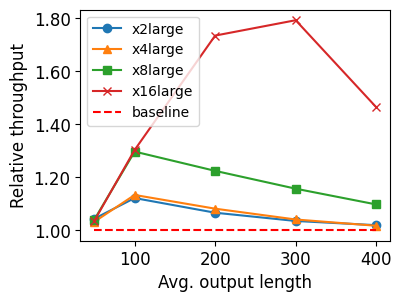

# NEO: Saving GPU Memory Crisis with CPU Offloading for Online LLM Inference

Online LLM inference powers many exciting applications such as intelligent chatbots and autonomous agents. Modern LLM inference engines widely rely on request batching to improve inference throughput, aiming to make it cost-efficient when running on expensive GPU accelerators. However, the limited GPU memory has largely limited the batch size achieved in practice, leaving significant GPU compute resources wasted. 

NEO is an online LLM inference system that offloads part of attention compute and KV cache states from the GPU to the local host CPU, effectively increasing the GPU batch size and thus inference throughput. To this end, NEO proposes asymmetric GPU-CPU pipelining and load-aware scheduling to balance GPU and CPU loads and fully utilize their compute and memory resources.

## Requirements

Python >= 3.10
PyTorch >= 2.4

2 versions of g++ (see `pacpu/build.sh` for more details):

- one >= 13 (for compiling CPU kernel)
- the other < 13 (for passing the NVCC version check)

Intel ISPC compiler == 1.23, which can be installed by `sudo snap install ispc --channel latest/edge`

## Installation

1. Clone the NEO repository and `cd` into the repo.

2. Install dependencies by `pip install -r requirements.txt.`

3. Install the swiftLLM library to your local environment by `pip install -e .`

4. Build and install auxiliary GPU operators library by `pip install -e csrc`. Remember to set `export CC=/usr/bin/gcc; export CXX=/usr/bin/g++; export CUDA_HOME=/usr/local/cuda; sudo update-alternatives --config gcc; sudo update-alternatives --config g++`

5. Build the CPU operator library by 

   ```bash
   cd pacpu
   bash build.sh <model-name> <tensor-parallel-degree> 
   # e.g bash build.sh llama2_7b 1
   cd ..
   ```

## Offline Example

```bash
cd NEO
python examples/example.py --model-path ... --model-name ...
# e.g. python examples/example.py --model-path /home/ubuntu/weights/Llama-2-7b-hf/ --model-name llama2_7b
```

Run `python examples/example.py --help` to see more options.

## Performance Results

### Load-latency Curves

The figure below (Figure 6c in the paper) shows online latencies of NEO and other baselines under different request rates.

vLLM-256 and vLLM-512 designate vLLM with chunked-prefilling at the chunk size of 256 and 512 tokens, respectively.


- Hardware: AWS g4.4xlarge instance, with Tesla T4 GPU, 8 cores of Xeon P-8259CL CPU, and 64 GB main memory.
- Model: LLaMa-2-7B
- Workload: OpenAI summarization comparison ([CarperAI](https://huggingface.co/datasets/CarperAI/openai_summarize_comparisons.))

### Generation Throughput

The figure below (Figure 10a in the paper) shows NEO's throughput gains over the non-CPU-offloading baseline under different workloads. NEO achieves up to 12.2%, 13.3%, 29.7%, and 79.3% higher throughput over the baseline under different CPU capacities.



- Hardware: AWS g5.nxlarge instances (n=2,4,8,16), with A10 GPU, 2n cores of EPYC 7R32 CPU, and 16n GB main memory.
- Model: LLaMa-3-8B
- Workload: Synthetic workloads with various input and output lengths. For a pair of input length $l_i$ and output length $l_o$, we synthesize requests with input and output lengths sampled independently and uniformly from $[0.9l_i, 1.1l_i]$ and $[0.9l_o, 1.1l_o]$, respectively. Here we fix $l_i=1000$ and pick $l_o$ from $\{50, 100, 200, 300, 400\}$.

## Reproduction

Below are instructions for reproducing Figure 6c in the paper. Instructions for Figure 10a are the same except for specific details noted in parentheses.

### With an AWS Account

1. Launch a g4dn.4xlarge (g5.16xlarge) instance in us-east-1 region with community AMI neo-ae-g4-image (neo-ae-g5-image).
2. SSH to the instance and run `mamba activate neo` in the shell.
3. run `cd NEO`
4. run `python evaluation/reproduce-fig6c.py`(`python evaluation/reproduce-fig10a.py`)

> NOTE: Although the model weights are pre-packaged in the images, the first time loading them would take about 1 hour. Therefore, it is recommended to download the weights from the internet and replace those embedded in  the image, which usually takes less than 10 min. The following script can be used to retrieve the weights from Huggingface:
>
> ```bash
> cd ~
> rm -r weights/*
> ip install 'huggingface_hub[cli]' 
> huggingface-cli login --token <your huggingface token>
> # For g5 instance:
> huggingface-cli download meta-llama/Llama-3.1-8B --local-dir weights/Llama-3-8B --exclude "*.pth"
> # For g4 instance:
> huggingface-cli download meta-llama/Llama-2-7b-hf --local-dir weights/Llama-2-7b-hf --exclude "*.pth"
> ```
>
> Alternatively, you may use the pre-packaged weights within the image. It is possible to encounter timeout issues during the initial execution of the evaluation script due to prolonged loading times. If this occurs, simply rerunning the script should resolve the issue.

### Without an AWS Account

1. Prepare a machine with 
   - Nvidia Tesla T4 (A10G) GPU;
   - CPU with AVX2 support;
   - At least 30GB (120GB) main memory for CPU KV Cache.
   - Ubuntu >= 22.04
2. Follow the steps in the Installation section to install dependencies.
3. Download LLaMa-2-7B (LLaMa-3-8B) model weights. You can refer to the NOTE above for weight retrieving scripts.
4. Modify `model_path` entry in `evaluation/configs/config-t4-7b.json` ( `evaluation/configs/config-a10-8b.json`) to the actual path to the model weights.
5. run `python evaluation/reproduce-fig6c.py`(`python evaluation/reproduce-fig10a.py`) in top level directory of the NEO repository.

### Expected Results

- The reproduced figure fig6c.pdf (fig10a.pdf) will be produced in `evaluation` directory.
- For Figure 6c, there will be only 2 lines (Neo and vLLM). By default the script only uses a small subset (100 requests) of the original input data (2000 requests) used in the original experiment. This is for the purpose of demonstration and quick verification of the results for faster evaluation. As a result, the latency would be lower than the original figure due to less average queuing latency.
- For Figure 10a, only 2 lines (x16large and baseline) in the original figure will be drawn.

> NOTE: You can change the hyperparameters of the experiments by modifying the corresponding scripts. Please refer to comments in the code for detailed instructions.
